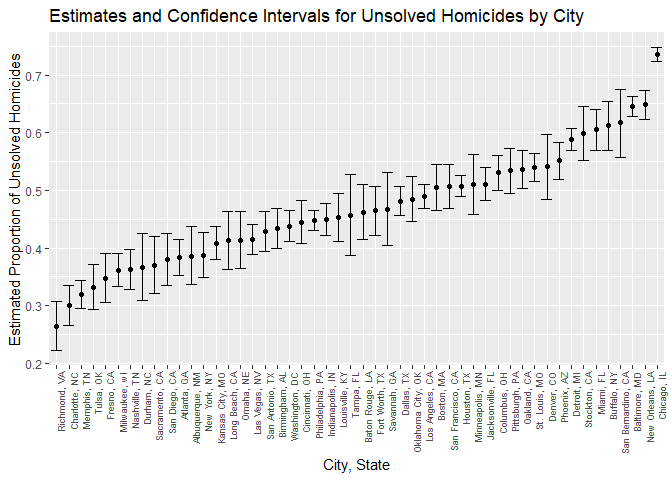

p8105_hw5_xs2529
================
Xinyi Shang
2023-11-13

``` r
library(tidyverse)
```

    ## ── Attaching core tidyverse packages ──────────────────────── tidyverse 2.0.0 ──
    ## ✔ dplyr     1.1.3     ✔ readr     2.1.4
    ## ✔ forcats   1.0.0     ✔ stringr   1.5.0
    ## ✔ ggplot2   3.4.4     ✔ tibble    3.2.1
    ## ✔ lubridate 1.9.3     ✔ tidyr     1.3.0
    ## ✔ purrr     1.0.2     
    ## ── Conflicts ────────────────────────────────────────── tidyverse_conflicts() ──
    ## ✖ dplyr::filter() masks stats::filter()
    ## ✖ dplyr::lag()    masks stats::lag()
    ## ℹ Use the conflicted package (<http://conflicted.r-lib.org/>) to force all conflicts to become errors

``` r
library(broom)
library(purrr)
library(dplyr)
library(readxl)
```

### Problem 1

``` r
homicide_df = 
  read_csv("data/homicide-data.csv")
```

    ## Rows: 52179 Columns: 12
    ## ── Column specification ────────────────────────────────────────────────────────
    ## Delimiter: ","
    ## chr (9): uid, victim_last, victim_first, victim_race, victim_age, victim_sex...
    ## dbl (3): reported_date, lat, lon
    ## 
    ## ℹ Use `spec()` to retrieve the full column specification for this data.
    ## ℹ Specify the column types or set `show_col_types = FALSE` to quiet this message.

This dataframe contains data in homicides in 50 large U.S. cities,
gathered by the *Washington Post*. The homicide data has 52179
observations and 12 columns. The variable names are uid, reported_date,
victim_last, victim_first, victim_race, victim_age, victim_sex, city,
state, lat, lon, disposition.

``` r
homicide_df_tidy = homicide_df |>
  janitor::clean_names() |>
  mutate(city_state = paste(city, state, sep = ", "))

city_summary = homicide_df_tidy|> 
  group_by(city_state) |>
  summarise(total_homicides = n(),
            unsolved_homicides = sum(disposition %in% c("Closed without arrest", "Open/No arrest")))
```

``` r
baltimore_data = city_summary |>
  filter(city_state == "Baltimore, MD")
baltimore_unsolved = baltimore_data|> select("unsolved_homicides") |> as.numeric()
baltimore_total = baltimore_data|> select("total_homicides") |> as.numeric()

baltimore_prop_test = prop.test(baltimore_unsolved, baltimore_total)

save(baltimore_prop_test, file = "data/baltimore_prop_test.RData")

baltimore_tidy = broom::tidy(baltimore_prop_test)

baltimore_result = baltimore_tidy |>
  select(estimate, conf.low, conf.high)

print(baltimore_result)
```

    ## # A tibble: 1 × 3
    ##   estimate conf.low conf.high
    ##      <dbl>    <dbl>     <dbl>
    ## 1    0.646    0.628     0.663

``` r
#define function
prop_test_city =  function(city_data) {
  unsolved = city_data|> select("unsolved_homicides") |> as.numeric()
  total = city_data|> select("total_homicides") |> as.numeric()
  prop_test_result = prop.test(unsolved, total)
  tidy(prop_test_result) |>
    select(estimate, conf.low, conf.high)
}

# filter out the city with less or equal to 1 cases
city_summary = city_summary |>
  filter(!total_homicides <= 1)

#run prop test
city_results = city_summary|>
  group_by(city_state) |>
  nest() |>
  mutate(prop_test_results = map(data, prop_test_city)) |>
  unnest(prop_test_results)|>
  select(estimate,conf.low,conf.high) |>
  janitor::clean_names() |>
  ungroup() |>
  arrange(estimate)
```

    ## Adding missing grouping variables: `city_state`

``` r
print(city_results)
```

    ## # A tibble: 50 × 4
    ##    city_state     estimate conf_low conf_high
    ##    <chr>             <dbl>    <dbl>     <dbl>
    ##  1 Richmond, VA      0.263    0.223     0.308
    ##  2 Charlotte, NC     0.300    0.266     0.336
    ##  3 Memphis, TN       0.319    0.296     0.343
    ##  4 Tulsa, OK         0.331    0.293     0.371
    ##  5 Fresno, CA        0.347    0.305     0.391
    ##  6 Milwaukee, wI     0.361    0.333     0.391
    ##  7 Nashville, TN     0.362    0.329     0.398
    ##  8 Durham, NC        0.366    0.310     0.426
    ##  9 Sacramento, CA    0.370    0.321     0.421
    ## 10 San Diego, CA     0.380    0.335     0.426
    ## # ℹ 40 more rows

Tulsa, AL is excluded from the proportional test analysis due to having
only one homicide case, which has been solved. This dataset is not
appropriate for the proportional test, so it is filtered out from the
analysis.

``` r
city_results_figure = city_results |>
  mutate(city_state = as.character(city_state)) |>
  ggplot(aes(x = fct_reorder(city_state, estimate), y = estimate)) +
  geom_point() +
  geom_errorbar(aes(ymax = conf_high, ymin = conf_low))+
  theme(axis.text.x = element_text(angle = 90, hjust = 1, size = 7)) +
  labs(title = "Estimates and Confidence Intervals for Unsolved Homicides by City",
       x = "City, State",
       y = "Estimated Proportion of Unsolved Homicides")

city_results_figure
```

<!-- -->

In total, there are 50 cities in the figures depicting estimates and
confidence intervals for Unsolved Homicides by City. The city with the
lowest estimated proportion of unsolved homicides is Richmond, VA with
an estimated proportion of 0.2634033 and a confidence interval of
(0.2228571, 0.3082658). Conversely, the city with the highest estimated
proportion of unsolved homicides is Chicago, IL, showing an estimated
proportion of 0.7358627, and a confidence interval of (0.7239959,
0.7473998).

### Problem 2

``` r
data_path = "data/data_p2"

file_names = list.files(data_path, full.names = TRUE)


data_full = map(file_names, ~read_csv(.x) |> 
                  mutate(file_name = .x)) |> #preserve data file name
  bind_rows()

save(data_full, file = "data/data_full_p2.RData")
```

``` r
data_full_tidy = data_full |>
  separate(file_name, into = c("folder1","folder2","name") , sep = "/") |>
  separate(name, into = c("arm", "subject_ID"), sep = "_") |>
  separate(subject_ID, into = c("ID", "suffix"), sep = "\\.") |>
  janitor::clean_names() |>
  select("arm","id","week_1","week_2","week_3","week_4","week_5","week_6","week_7","week_8") |>
  pivot_longer(col =3:10, names_to = "week", values_to = "value")
```

``` r
p2_figure = ggplot(data_full_tidy, aes(x = week, y = value, group = id, color = id))+
  geom_point()+
  geom_line()+
  facet_wrap(~arm)+
  theme(axis.text.x = element_text(angle = 45, hjust = 1, size = 7)) +
  labs(title = "Spaghetti Plot of Observations Over Time",
       x = "Time",
       y = "Value")

p2_figure
```

<!-- -->

In the control arm, the value remains relatively stable with
fluctuations from week 1 to week 8. Conversely, in the experimental arm,
there is a observable upward trend in the value from week 1 to week 8.

### Problem 3

``` r
set.seed(1)

# set parameters
n = 30
sigma = 5
alpha = 0.05
true_values_0 = 0
true_values = c(0, 1, 2, 3, 4, 5, 6)
n_trial = 5000

# set function
simulate_power = function(true_mu) {
  p_value = numeric(n_trial)
  reject_null = numeric(n_trial)
  estimate_mu = numeric(n_trial)
  
  for (i in 1:n_trial) {
    #generate data from normal distribution 
    data = rnorm(n, mean = true_mu, sd = sigma)
    result = t.test(data, mu = 0) |>  
      broom::tidy() |> 
      janitor::clean_names()
    
    # Save results for each trial
    p_value[i] = result |> 
      select(p_value)|> 
      as.numeric()
    reject_null[i] = result |> 
      select(p_value) < alpha
    estimate_mu[i] = result |> 
      select(estimate) |> 
      as.numeric()
  }
  
  #return result as tibble data frame
  return(tibble(
    true_mu = rep(true_mu, n_trial),
    p_value = p_value,
    reject_null = reject_null,
    estimate_mu = estimate_mu
  ))
}
```

``` r
# Run simulations
sim_results_0 = map(true_values_0, simulate_power) |> 
  bind_rows()
print(sim_results_0)
```

    ## # A tibble: 5,000 × 4
    ##    true_mu p_value reject_null estimate_mu
    ##      <dbl>   <dbl>       <dbl>       <dbl>
    ##  1       0  0.629            0       0.412
    ##  2       0  0.368            0       0.664
    ##  3       0  0.534            0       0.551
    ##  4       0  0.487            0       0.567
    ##  5       0  0.0599           0      -1.65 
    ##  6       0  0.229            0       1.19 
    ##  7       0  0.738            0       0.334
    ##  8       0  0.209            0      -1.19 
    ##  9       0  0.887            0       0.122
    ## 10       0  0.472            0       0.684
    ## # ℹ 4,990 more rows

At $\mu = 0$, the average estimate of $\hat{\mu}$ is -2.6209352^{-4}.
Out of 5000 trials, 254 resulted in rejecting the null hypothesis
$H_0: \mu = 0$, so the power of the test is 0.0508

``` r
sim_results = map_df(true_values, simulate_power) |> 
  bind_rows() 

save(sim_results, file = "data/p3_sim_result.RData")

print(sim_results)
```

    ## # A tibble: 35,000 × 4
    ##    true_mu p_value reject_null estimate_mu
    ##      <dbl>   <dbl>       <dbl>       <dbl>
    ##  1       0   0.549           0       0.520
    ##  2       0   0.188           0       1.11 
    ##  3       0   0.220           0       1.01 
    ##  4       0   0.309           0      -0.835
    ##  5       0   0.365           0      -0.892
    ##  6       0   0.503           0       0.557
    ##  7       0   0.238           0       1.04 
    ##  8       0   0.144           0       1.40 
    ##  9       0   0.180           0       1.15 
    ## 10       0   0.634           0      -0.500
    ## # ℹ 34,990 more rows

``` r
power_results = sim_results |> 
  group_by(true_mu) |> 
  summarize(power = sum(reject_null) / n_trial)

#Power vs. True μ
ggplot(power_results, aes(x = true_mu, y = power)) +
  geom_point() +
  geom_line() +
  labs(title = "Power vs. True μ",
       x = "True μ",
       y = "Power")
```

<!-- -->

The power increases with the increase of the true $\mu$. This is
attributed to the increase of the probability of rejecting the null
hypothesis $H_0: \mu = 0$ as the true $\mu$ increases. Consequently, the
power, which is the proportion of times where the null hypothesis is
rejected, is expected to show an upward trend, and eventually close to
$1$.

``` r
# Average Estimate of μ^ vs. True μ
average_estimate_results = sim_results |>
  group_by(true_mu) |>
  summarize(
    avg_estimate_mu = mean(estimate_mu)
  )

estimate_results = sim_results |>
  filter(reject_null == 1) |>
  group_by(true_mu) |>
  summarize(
    avg_estimate_mu_reject = mean(estimate_mu)
  ) |>
  full_join(average_estimate_results, join_by(true_mu)) |>
  pivot_longer(
    cols = c(avg_estimate_mu, avg_estimate_mu_reject),
    names_to = "estimate_mu_group",
    values_to = "values"
  )

ggplot(estimate_results, aes(x = true_mu, y = values, group = estimate_mu_group, color = estimate_mu_group)) +
  geom_line() +
  geom_point() +
  labs(title = "Average Estimate of μ^ vs. True μ",
       x = "True μ",
       y = "Average Estimate of μ^")
```

<!-- -->

When the true mean, denoted as $\mu$, is equal to zero, both the overall
average estimate $\hat{\mu}$ and the rejected group’s $\hat{\mu}$ are
expected to center around zero.

Subsequently, the average estimate $\hat{\mu}$ for the rejected group
exhibits a slight elevation compared to the overall group’s average
estimate $\hat{\mu}$. This divergence arises because, with an increasing
true $\mu$, the group that fails to reject the null hypothesis
$H_0: \mu = 0$ tends to have a $\hat{\mu}$ closer to zero. Conversely,
the group that rejects the null hypothesis $H_1: \mu \neq 0$ tends to
exhibit a $\hat{\mu}$ higher than that, because the true $\mu$ is higher
than 0.

As the true $\mu$ continues to increase, the average estimate
$\hat{\mu}$ of the rejected group gradually approaches the overall
average estimate of $\hat{\mu}$. This phenomenon is attributable to the
fact that, as the true $\mu$ deviates further from zero, the probability
of rejecting the null hypothesis rises. Consequently, the $\hat{\mu}$
values for the rejected group move closer to the overall group’s
$\hat{\mu}$. Consequently, the average estimate $\hat{\mu}$ for the
rejected cases should converge toward the overall average estimate of
$\hat{\mu}$.
